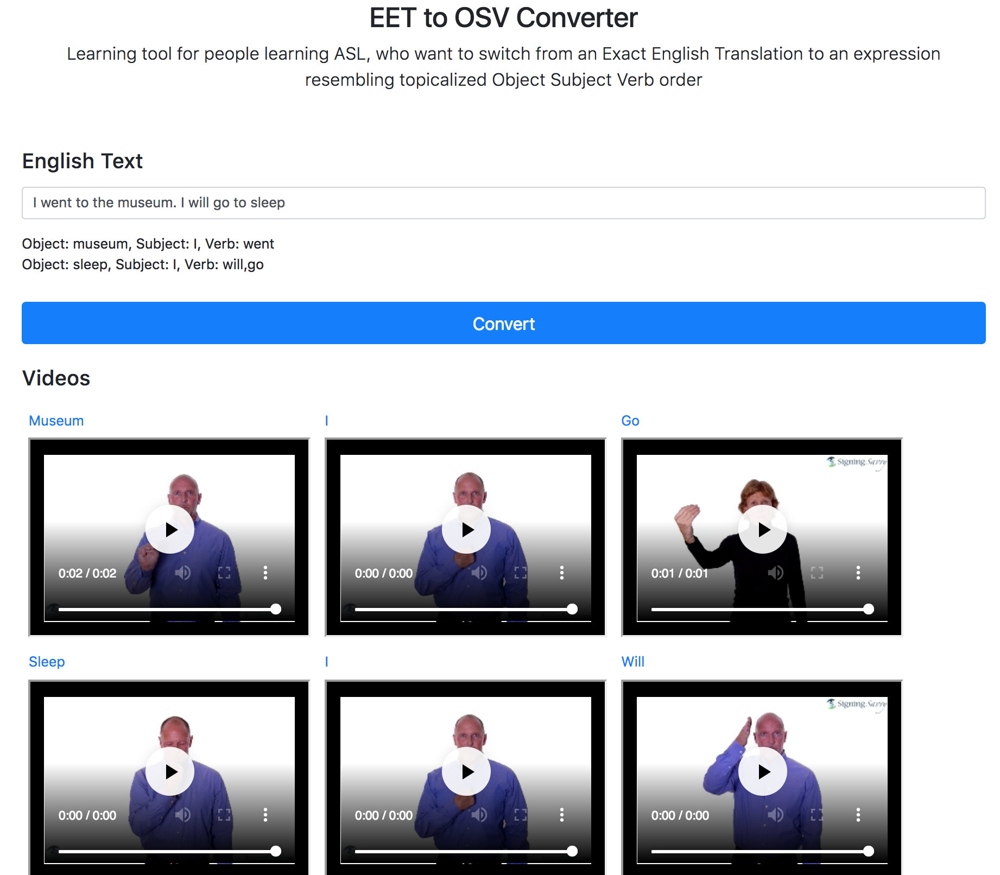

# EET to OSV Converter
[Grammar is ASL](http://www.lifeprint.com/asl101/pages-layout/grammar.htm) is not the same as spoken English. For example, 'to be' verbs do not exist, there are many different arragements of parts of speech, and adjectives go after nouns. 

This is a tool people learning ASL, who want to switch from an Exact English Translation to an expression resembling topicalized Object Subject Verb order.

## Setup
- clone and cd into repo
- `pip install -r requirements.txt`
- run locally `python main.py`

